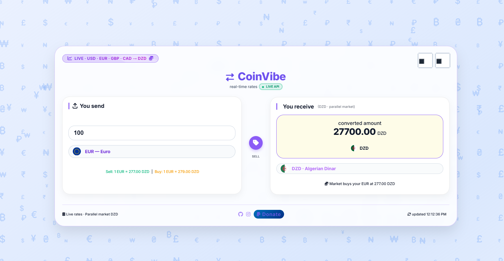

# CoinVibe – Parallel Market DZD Converter

**CoinVibe** is a fast, minimal web tool built for Algerians to convert USD, EUR, GBP, and CAD to Algerian Dinar (DZD) using **parallel market (black market) rates** — not the official Bank of Algeria rate.



## Features

- **Parallel market rates** – Fetches real-time black market DZD rates (Square Port-Saïd, Algiers) from devisesquare.com, with hardcoded fallback values if unavailable.
- **Buy / Sell toggle** – Switch between the rate you get when selling foreign currency and the rate you pay when buying it.
- **Supported currencies** – USD, EUR, GBP, CAD → DZD only.
- **Instant conversion** – Updates as you type or change currency.
- **Dynamic background** – Background gradient and floating symbols change color per selected currency.
- **Pixel eye tracker** – Eyes follow your mouse; click to toggle dark / light mode.
- **Dark / Light mode** – Smooth theme toggle with localStorage persistence.
- **Auto-refresh** – Rates update every 60 seconds.
- **Fully responsive** – Works on desktop, tablet, and mobile.

## Live Demo

[coinvibe on GitHub Pages](https://malaklabs.github.io/Coinvibe-CurrencyConverter/)

## Tech Stack

- HTML5, CSS3, Vanilla JavaScript (ES6+)
- [ExchangeRate-API](https://www.exchangerate-api.com/) – fiat USD pivot rates
- [devisesquare.com](https://devisesquare.com/) – parallel market DZD scraping via CORS proxy
- Font Awesome 6, flag icons (lipis.dev)

## Usage

No build step. Open `index.html` in a browser or serve with any static server:

```bash
npx serve .
```

## Support

If this tool is useful to you, consider buying me a coffee:  
[paypal.me/dutys1em](https://paypal.me/dutys1em)
